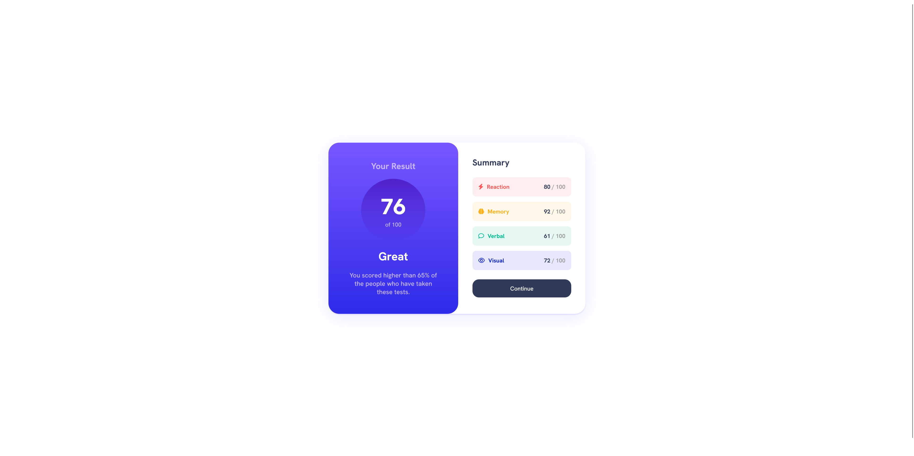
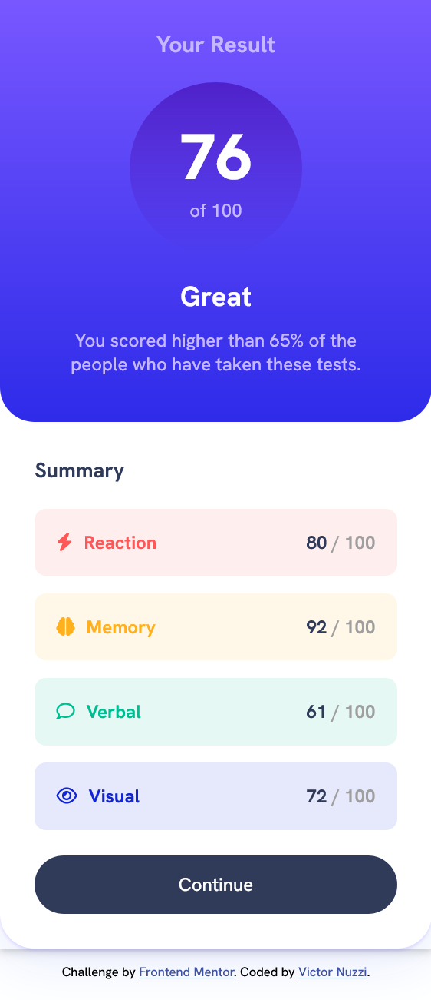

# 💪 Results Summary Component

Repositório criado para o exercício ["Results Summary Component"](https://www.frontendmentor.io/challenges/stats-preview-card-component-8JqbgoU62) do [Frontend Mentor](https://www.frontendmentor.io).

## 🎯Desafio

"This challenge has something for everyone. It’s a HTML and CSS only project, but we’ve also provided a JSON file of the test results for anyone wanting to practice JS."

*(Este desafio tem algo para todos. É um projeto apenas em HTML e CSS, mas também fornecemos um ficheiro JSON com os resultados dos testes para quem quiser praticar JS.)*

### ⚒️ Tecnologias utilizadas 
- HTML5
- CSS3

### 🤩 Resultado

- [Confira aqui o resultado!](https://fem-vn-results-summary-component.netlify.app)

### 📸 Screenshots

  
Desktop:

  
  </img>
     

  
Mobile:

  
  </img>

